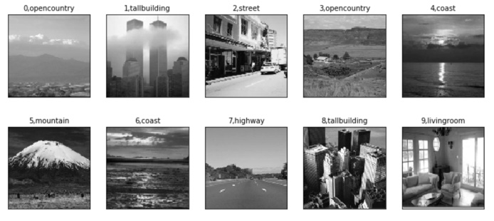

## This is a 2D CNN project that I utilize Transfer Learning with DenseNet201, pretrained model to match various location scenes.

## Tranfer Learning has become quite popular these dates because not only because the entire AI industry is evolving so fast and new models came out really fast but also it's probably cost efficient to use a pretrained model and utilize transfer learning rather than training a model from scratch.  It really depends on the situation.

    1.Data preprocessing and data augmentation
    2. DNN/CNN model construction and hyper-parameter tuning

## 這是一個2D CNN的專案，我在這裡使用遷移學習(TL: Transfer Learning)的方法，將不同的景象圖檔做分類。雖然這是景象圖檔的分類，但是相同的方法可以使用於製造業的瑕疵偵測，試想如果有足夠的機構的瑕疵圖檔與完整圖檔，就可以分類為瑕疵品與正常品，也可以依照瑕疵程度之不同，分為不同類別，在分成不同等級的瑕疵後可以再做適當的處理，有效的減少前線作業員的負擔。

## 遷移學習是運用已經訓練好的模型，來做預測，這也是現在一種很普遍的方法。因為AI這個領域的進展真的很快，很短時間內就有新的模型產生，對於特定的公司，可能使用利用訓練好的模型或許是成效更佳的方法。當然啦，這也是依照個案不同而需要做相應的決策

    1.資料前處理 與 資料增量
    2. DNN/CNN 模型建構 與 參數調整
